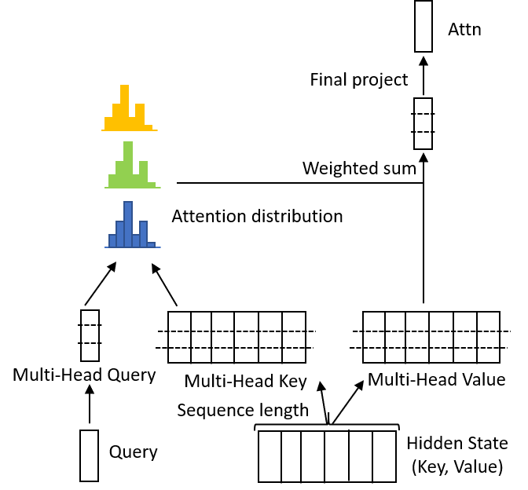
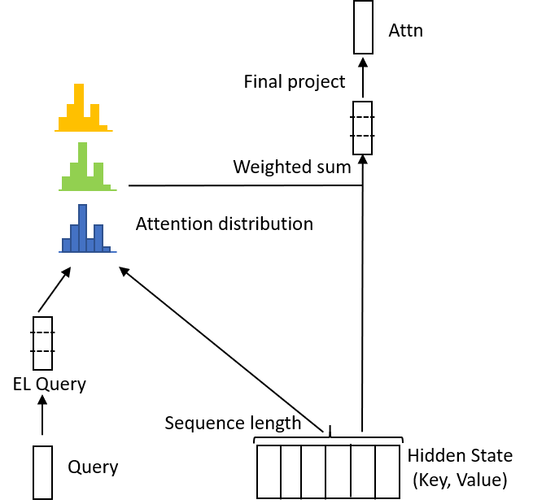

# EL-Attention: Memory Efficient Lossless Attention for Generation

[https://arxiv.org/abs/2105.04779](https://arxiv.org/abs/2105.04779)

## Introduction

Incremental decoding of transformers is often implemented by caching the calculated previous keys and values to reuse computes, but it requires caching a different tensor at each layer and each head of the decoder since they are not the same. EL-Attention aims at reducing the cache size by reordering the operations and shifting the burden to the query side. The core idea is to leverage the associative property of matrix multiplications, and instead of first projecting the hidden states to keys/values, the projection is applied to the queries, such that only a single set of hidden states need to be cached for multiple layers and all attention heads. The extensive experiments show EL-attention speeds up existing models (e.g., Transformer, BART and GPT-2) by 1.6x to 5.3x without accuracy loss. 

## Comparison between MultiHead and EL-Attention Attention

  |  
:-------------------------:|:-------------------------:
(a) Multi-Head Attention             |  (b) EL-Attention


*(a) Multi-head attention: query, key, and value are converted to their multi-head formats respectively, then the attention probability and attention result for each head are calculated; at last, results are aggregated to get the final output. (b) EL-attention: it only applies linear conversion to query. The hidden state, which is encoder output or previous layer output, is directly used as both key and value and shared for all heads.*

## Results

Speed is benchmarked on a V100 GPU with 16GB memory. We choose batch size based on the maximum batch size that can fit in memory.

**Inference Speed by Beam Search**
|Model | Parameter <br> Number | Task |  Multi-Head Attention <br> fp16 (fp32) |  EL-Attention <br> fp16 (fp32) |  Speed Up Ratio <br> fp16 (fp32) |
|---|---|---|:---:|:---:|:---:|
| `transformer` | 270M | SQuAD 1.1 | 170.9 (86.6) | 458.1 (173.6) | **2.7x** (2.0x) |
| `bart.large` | 400M | XSum | 14.7 (6.8)| 69.4 (26.3)  | **4.7x** (3.9x) |
| `bart.large` | 400M | CNN/DailyMail  | 5.7 (3.4) | 28.6 (12.2)  | **5.0x** (3.6x) |
| `gpt-2.small` | 117M | CNN/DailyMail | 2.1 (1.5) | 3.8 (2.5) | **1.8x** (1.7x) |
| `gpt-2.medium` | 345M | CNN/DailyMail | 0.9 (0.6) | 2.0 (1.1) | **2.2x** (1.8x) |

**Inference Speed by Diverse Beam Search**
|Model | Parameter <br> Number | Task |  Multi-Head Attention <br> fp16 (fp32) |  EL-Attention <br> fp16 (fp32) |  Speed Up Ratio <br> fp16 (fp32) |
|---|---|---|:---:|:---:|:---:|
| `transformer` | 270M | SQuAD 1.1 | 162.3 (82.1) | 454.1 (171.8) | **2.8x** (2.1x)  |
| `bart.large` | 400M | XSum | 15.8 (7.2) | 71.9 (27.5) | **4.6x** (3.8x)   |
| `bart.large` | 400M | CNN/DailyMail | 5.4 (3.2) | 28.5 (12.0) | **5.3x** (3.8x) |

**Inference Speed by Greedy Search**
|Model | Parameter <br> Number | Task |  Multi-Head Attention <br> fp16 (fp32) |  EL-Attention <br> fp16 (fp32) |  Speed Up Ratio <br> fp16 (fp32) |
|---|---|---|:---:|:---:|:---:|
| `transformer` | 270M | SQuAD 1.1 |  436.4 (190.3)   | 699.7 (260.3)   | **1.6x** (1.4x)  |
| `bart.large` | 400M  | XSum | 42.6 (15.0) | 107.8 (44.9)  | **2.5x** (3.0x)  |
| `bart.large` | 400M | CNN/DailyMail | 13.0 (7.0) | 40.0 (19.5) | **3.1x** (2.8x) |
| `gpt-2.small` | 117M  | CNN/DailyMail | 14.7 (9.0) | 26.2 (13.6) | **1.8x** (1.5x) |
| `gpt-2.medium` | 345M  | CNN/DailyMail | 5.9 (3.6) | 10.4 (5.9) | **1.8x** (1.6x) |

**Inference Speed on Various Batch Size for BART model on CNN/DailyMail**
| <br> Batch size | Multi-Head Attention <br> No Cache | Multi-Head Attention <br> Has Cache | EL-Attention |
|---|:---:|:---:|:---:|
| 32 | 1.9 (1x) | 5.7 (3x) | 8.0 (4.2x) |
| 64 | 1.9 (1x) | OOM | 12.6 (6.6x) |
| 128 | OOM | OOM | 21.3 (11.2x) |
| 320 | OOM | OOM | 28.6 (15.1x) |

**Comparison of memory sizes used for storing input related model states**
| Batch Size | Sequence <br> Length | Multi-Head <br> Attention | EL <br> Attention |
|--- |--- | :---: | :---: |
| 32 | 256 | 1.5 GB | 0.02 GB |
| 32 | 1024 | 6 GB | 0.06 GB |
| 64 | 256 | 3 GB | 0.03 GB |
| 64 | 1024 | 12 GB | 0.13 GB | 
| 320 | 256 | 15 GB | 0.15 GB |
| 320 | 1024 | 60 GB | 0.63 GB |

## Example usage

##### Command line:
```bash
$ fastseq-generate-for-fairseq \
    ...
    --use-el-attn
```

##### Python API:
```bash
python summarize.py \
    --model-dir bart.large.cnn/ \
    --model-file model.pt \
    --src data/test.source \
    --bsz 320 \
    --out 320_test.hypo \
    --use-el-attn
```
##### [Run in Colab](xxx)

## Citation

```bibtex
@article{yan2021attention,
  title={EL-Attention: Memory Efficient Lossless Attention for Generation},
  author={Yan, Yu and Chen, Jiusheng and Qi, Weizhen and Bhendawade, Nikhil and Gong, Yeyun and Duan, Nan and Zhang, Ruofei},
  journal={arXiv preprint arXiv:2105.04779},
  year={2021}
}
```
